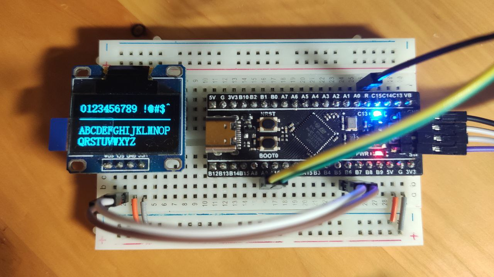

## Simple SSD1306 driver

Supported Features:

- I2C interface
- draw patterns
- print characters
- turn on and off the screen

### Example

```c
ssd1306_init();
ssd1306_print("0123456789 !@#$^", Line1);
for (uint16_t x = 0; x < 128; x++) {
    ssd1306_draw_pixel(x, 24);
}
ssd1306_print("ABCDEFGHIJKLMNOP", Line3);
ssd1306_print("QRSTUVWXYZ", Line4);
ssd1306_commit_buffer();
```



### How to use

1. Implement the function `ssd1306_hal_i2c_write` in the file `ssd1306_hal.c`
2. Import the header file `ssd1306.h` and use the functions provided there
3. Add more characters to the file `ssd1306_font.c`, or extend the functionality of the driver, as you like